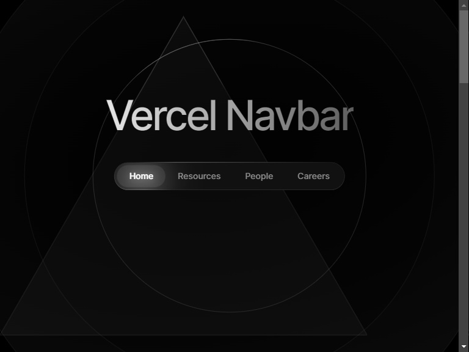

# Vercel Navbar Recreation

**[Inspired from vercel.com/design](vercel.com/design)**



## Compare to original

- [Original](https://vercel.com/)
- [Recreation-Codepen](https://codepen.io/chaseottofy/pen/jOQevOV)
- [Recreation-GithubPages]()

---

### Fully functional

- Navbar toggles between fixed and relative positioning depending on scroll position.
- Navbar links are functional.
- Responsive design.
- Animations implemented.
- Toggles between switch elements on scroll over relavent sections.

## Built With

- TypeScript
- JavaScript
- HTML & CSS

---

## Installation and Usage

This project uses a bare-bones tsup configuration.

**install**
```bash
git clone https://github.com/username/reponame.git
cd reponame
npm install
```

**use**
```bash
npm run predeploy
```
- Predeploy will bundle typescript, and copy minified html/css/ect to /dist/ folder
- Open /dist/index.html

---


## License

This project is open-source and available to everyone under the [MIT License](LICENSE).
